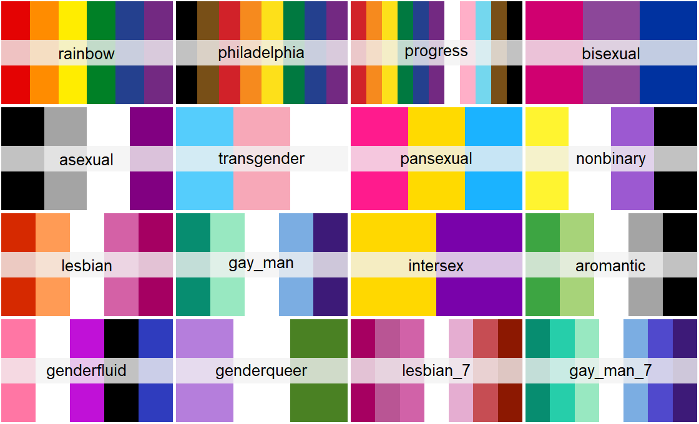

# pridepalettes

This repo contains the beginnings of some work on producing an R package of pride flag palettes for use with ggplot2.

This was taken on by our friends at [Turtletopia](https://turtletopia.github.io/), an the resulting package, {gglgbtq} is at <https://github.com/turtletopia/gglgbtq>.

The corresponding blog post is on both the [Turtletopia site](https://turtletopia.github.io/2022/08/12/show-pride-on-your-plots/) and the [RainbowR site](https://rainbowr.netlify.app/posts/2022-08-18_gglgbtq/).

The palettes available (as of Aug 18th 2022) are in the image below:

For more details on installation and usage, see the [gglgbtq repo](https://github.com/turtletopia/gglgbtq).